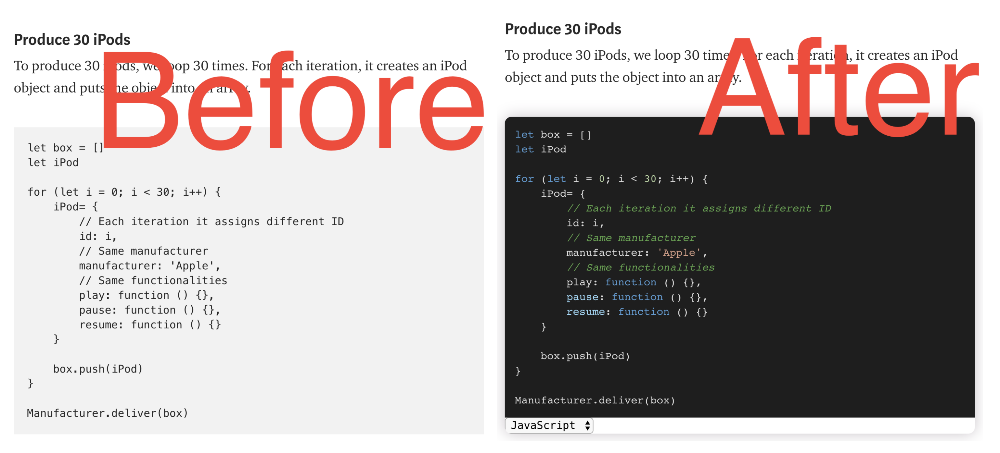
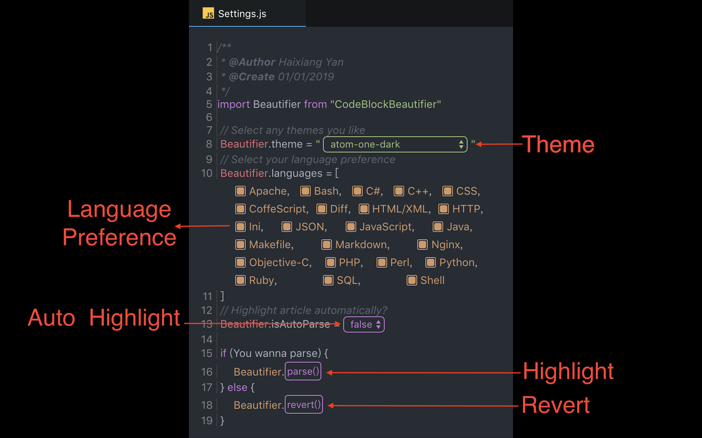

# Code Block Beautifier

    

A chrome extension for beautifying code blocks in any websites that have `<pre><code>...</code></pre>` structure.
Thanks to [highlight.js](https://highlightjs.org/), I don't need to write so many codes for language detection and tons of themes 😂.

You can watch a [video](https://www.youtube.com/watch?v=XdkuZrC1PJQ) to preview it.

[中文文档请看这里](./README-CN.md)

## Install & Download

Check [this](https://chrome.google.com/webstore/detail/code-block-beautifier/gpcjjddhdnilcbddlonlfgdbejfboonn) on Chrome app store.

## Screenshot

## How to use

## Features

* ⚒ Beautify any code blocks wrapping in `<pre/>` automatically. 

* 🧲 Beautify code blocks according to your languages preference.

* 🔓 Auto detect what languages that the author defines

* 🎁 Supporting [Medium](https://medium.com/), [StackOverflow](https://stackoverflow.com/),
[简书](https://www.jianshu.com/), [知乎](https://www.zhihu.com/), [W3C Plus](https://www.w3cplus.com/).

* 🎉 More than 80 themes are available. Can switch to any language highlight solutions.

* 🎊 More than 20 language highlight themes are available. Can switch to any highlight themes you like.

## Purpose
The main reason I built it is because [Medium](www.medium.com) doesn't highlight our codes.
Well, I know there are several ways to embed codes in the articles, but some people (like me) don't wanna create a gist or codesandbox project to highlight the codes. So most of time, I see this 🙄:

What I expect is like this 😄:

So I built an extension to beautify code blocks in [Medium](www.medium.com).

It can also be used for other websites that contain `<pre/>`.
The only thing you need to do is to press the "Parse" button!

## Future
There may have some problems that I haven't found for this extension yet. If you have any questions or find any bugs, please put an issue on this repo. Thank you!

## Change Log

### v1.0

* Add parsing action. It is able to parse code blocks and apply given theme.

* Add styles to beautify each code blocks.

### v1.0.1

* Enable user to select highlight languages with adding a panel below code blocks. 

* Enable user to select different theme and apply to all code blocks.

### v1.0.2

* Enable user to select highlight languages preference. Because highlight.js may detect wrong languages,
setting highlight languages preference can let it detect correctly.

* Add revert action. User can revert parsed code blocks to original styles.

### v1.0.3

* Add background color of theme to inline style of `<code/>` to adapt most websites.

* Add auto detection for those websites that have already defined what languages should be highlighted.

* Add auto parsing action.

* Fix bugs:

    * Remove loading CSS files at the beginning
    
    * Compatible with some websites that have CSS styles on `<pre/>` or `<code/>`
    
    * Reverting to original HTML elements.
    
    * Can switch language preference immediately.
    
### v1.0.4

* Update to a new UI. Switching to "Editor" UI from plain HTML UI.

* Fix bugs:
    
    * Enable to cover original styles with hljs for Popup page.
    
    * Add event hub to notify all components in Popup page.
    
    * Enable to detect language by checking attributes of `<pre/>` and `<code/>`.
    
### v1.0.5

* Fix bugs:
    
    * Improve auto detection by adding regular expression to exclude sensitive string patterns in HTML element attributes. 

### v1.0.6

* Fix bugs:
    
    * Avoid to covert codes to comments 