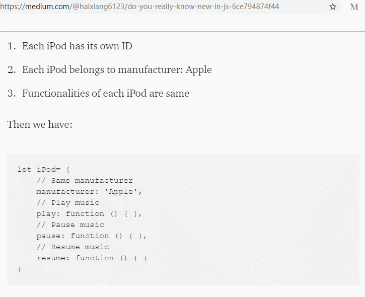
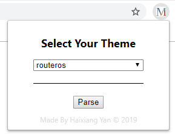
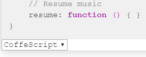
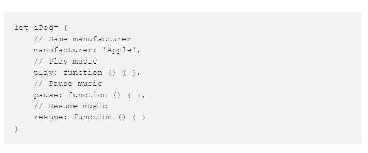
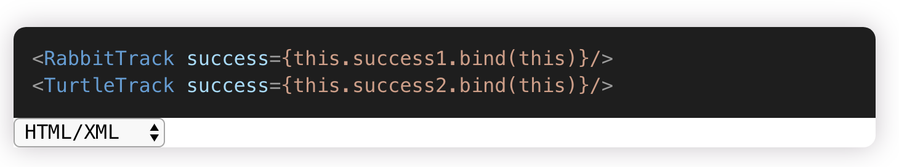

# Code Block Beautifier 
A chrome extension for beautifying code blocks in any websites that contain `<pre/>` elements. It is developed based on [highlight.js](https://highlightjs.org/) and [Chrome Extension API](https://developer.chrome.com/home).

## Screenshot

## Features

* Beautify any code blocks wrapping in `<pre/>` automatically.

* Can change to adapt any language highlight solutions manually.

* Can switch any themes you like.

* More than 80 themes are available.

* More than 20 languages are available.

## Download

Check [this]() on Chrome app store.

or

[Download]() it anyway.

## How to use

### Switch theme
Left click the extension, then it will popup a panel. Select any themes you love, and it will switch to that theme immediately.

### Switch languages
Because Medium.com doesn't allow us to specify what languages for code blocks, highlight.js may detect a wrong language.
You may need to select the correct language manually.

On the bottom left of each code block, there's a selector for you to pick the correct language.

## Purpose
The main reason I develop it it because [Medium](www.medium.com) doesn't provide a good highlight code blocks.
Well, I know there are several ways to embed codes in it, but some people (like me) don't wanna create a gist or code sandbox project
to put codes on my block. So most of time, I see this:

What I expect should be like this:

So I build an extension to beautify code blocks in [Medium](www.medium.com).

It does beautify all code blocks. It can also be used to other websites that contain `<pre/>`.
The only thing you need to do is to press the "Parse" button!

## Future
There may have some problems that I haven't found for this extension. If you have any questions or find any bugs, please put an issue on this repo. Thank you!